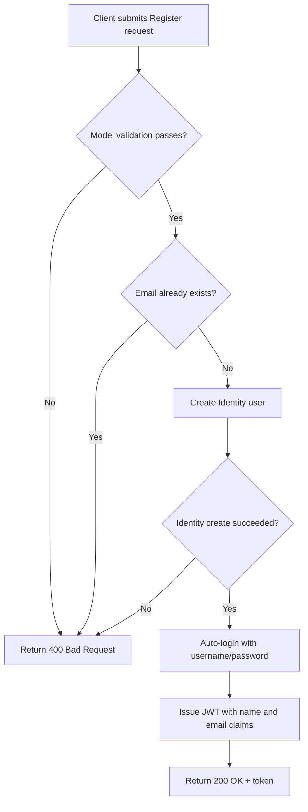
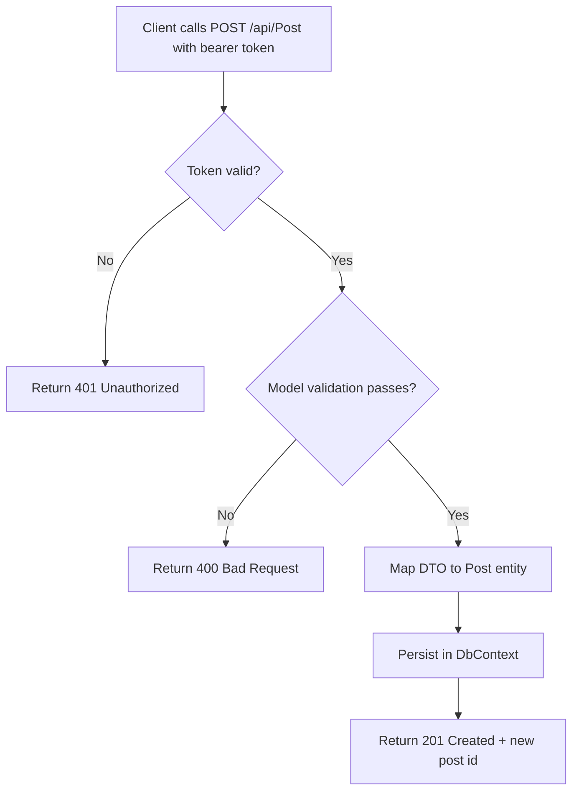
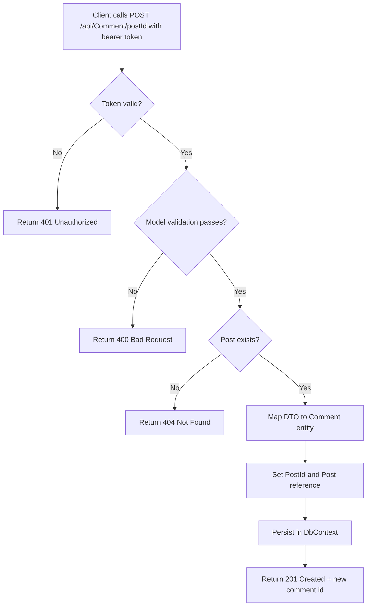
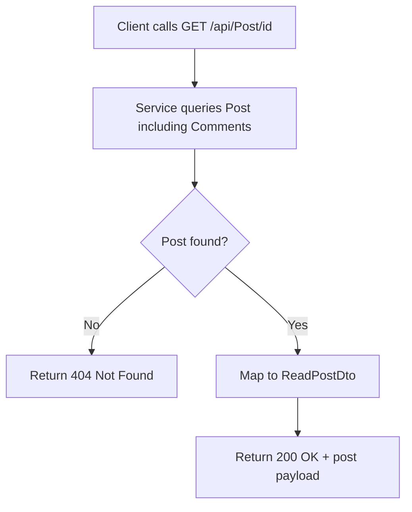

# PostHubAPI Project Requirements

## 1. Purpose

PostHubAPI is a backend web API for a lightweight blogging platform. Its purpose is to provide secure and testable REST endpoints for:

- User registration and login with JWT-based authentication.
- Blog post lifecycle management (create, read, update, delete).
- Comment lifecycle management tied to posts.
- A small calculator endpoint for basic arithmetic operations.

The API is designed for local development and learning-friendly usage while preserving production-safe defaults for security and deployment behavior.

## 2. Scope

### In Scope

- User authentication endpoints (`/api/User/Register`, `/api/User/Login`).
- Post endpoints (`/api/Post`) with authorization required for write operations.
- Comment endpoints (`/api/Comment`) with authorization required for all operations.
- Calculator endpoint (`/api/Calculator`) for `add`, `subtract`, `multiply`, and `divide`.
- Swagger/OpenAPI availability in development.

### Out of Scope

- Rich role/permission management beyond authenticated vs anonymous access.
- Advanced moderation workflow, tagging, search, and pagination requirements.
- External notification services or event-driven integrations.

## 3. Core Business Rules

### 3.1 Authentication and Authorization

- Registration requires valid email, username, password, and password confirmation.
- Login requires username and password.
- Registration returns a JWT token by immediately authenticating the newly created user.
- JWT tokens must contain name and email claims.
- JWT token lifetime is 3 hours.
- Post write operations (`POST`, `PUT`, `DELETE`) require a valid bearer token.
- All comment operations require a valid bearer token.
- Post read operations (`GET`) are public.

### 3.2 Post Rules

- A post must have:
  - `Title` (required, max 100 characters on creation).
  - `Body` (required, max 200 characters on creation).
- New posts start with `Likes = 0`.
- `CreationTime` is automatically set by the domain model.
- Editing or deleting a non-existent post returns a not-found result.

### 3.3 Comment Rules

- A comment must have:
  - `Body` (required, max 80 characters).
- A comment must belong to exactly one post (`PostId` required).
- Creating a comment for a non-existent post returns a not-found result.
- Editing or deleting a non-existent comment returns a not-found result.

### 3.4 Data Relationship Rules

- One post can have many comments.
- Each comment belongs to one post.
- Deleting a post cascades delete to all related comments.

### 3.5 Calculator Rules

- Supported operations: `add`, `subtract`, `multiply`, `divide`, and symbols `+`, `-`, `*`, `/`.
- Operation input must be non-empty.
- Division by zero is rejected with a bad-request response.
- Unsupported operations are rejected with a bad-request response.

## 4. Workflows

### 4.1 User Registration and Login

### 4.2 Create Post (Authorized)

### 4.3 Create Comment (Authorized)

### 4.4 Read Post with Comments

## 5. Tech Stack Architecture

### 5.1 Platform and Runtime

- .NET 8 (`net8.0`)
- ASP.NET Core Web API
- C# with nullable reference types enabled

### 5.2 Application Architecture

The application follows a layered architecture:

- Controllers layer:
  - HTTP transport concerns, routing, status code mapping, model-state checks.
- Services layer:
  - Business behavior, validation orchestration, and exception-driven not-found handling.
- Data layer:
  - Entity Framework Core DbContext and entity relationships.
- DTO/profile mapping layer:
  - AutoMapper profiles for request/response models.

### 5.3 Data and Identity

- Entity Framework Core:
  - Development: InMemory database.
  - Non-development: SQLite via `DefaultConnection`.
- ASP.NET Core Identity (`IdentityUser`-based custom `User` type).
- JWT bearer authentication using symmetric signing key from configuration.

### 5.4 API and Tooling

- Swagger/OpenAPI (enabled in development).
- REST endpoints under `/api/*`.
- Dependency injection for services and cross-cutting runtime dependencies.

### 5.5 Testing Architecture

- Test framework: xUnit.
- Integration-style API tests with `Microsoft.AspNetCore.Mvc.Testing`.
- Authorization behavior tests validate anonymous vs authenticated access paths.

### 5.6 Key Dependencies

- `Microsoft.AspNetCore.Authentication.JwtBearer`
- `Microsoft.AspNetCore.Identity.EntityFrameworkCore`
- `Microsoft.EntityFrameworkCore.InMemory`
- `Microsoft.EntityFrameworkCore.Sqlite`
- `AutoMapper.Extensions.Microsoft.DependencyInjection`
- `Swashbuckle.AspNetCore`

## 6. Non-Functional Requirements

- Security:
  - JWT secret must be provided outside source control for local execution.
  - HTTPS metadata checks are enabled outside development.
- Reliability:
  - Not-found resources return deterministic `404` responses.
  - Invalid requests return deterministic `400` responses.
- Maintainability:
  - Separation between controllers, services, DTOs, and data models.
  - Test project exists for controller and configuration verification.

## 7. Assumptions and Constraints

- Current authorization model is endpoint-level, not resource-ownership-level.
- Current post edit DTO does not enforce the same required/length constraints as create.
- Current environment switching intentionally prioritizes fast local setup in development.

## 8. Future Requirement Candidates

- Add ownership checks so only post/comment authors can edit or delete their resources.
- Add pagination, filtering, and sorting for post and comment listing.
- Add refresh-token workflow for longer sessions.
- Add database migrations and production-grade persistence defaults.
